# AIRBOT Play PTK Cloth Folding Demo

[English](README.md) | [中文](README.zh-CN.md)

This repository documents the reproduction of a dual-arm AIRBOT Play demonstration that folds a plain M/L short-sleeve T-shirt with a PI0.5 policy.

## Demo overview

Two workstation options use the same robot, camera, and policy configuration:

| Workstation | Use case | Requirements |
| --- | --- | --- |
| TV-backed workstation | Demonstrating robustness to dynamic visual backgrounds | A TV below the work surface and an 8 mm transparent glass cover |
| White-table workstation | Fast deployment and standard demonstrations | A white table at least 1.7 m by 1.2 m, with a 6-8 mm glass cover |

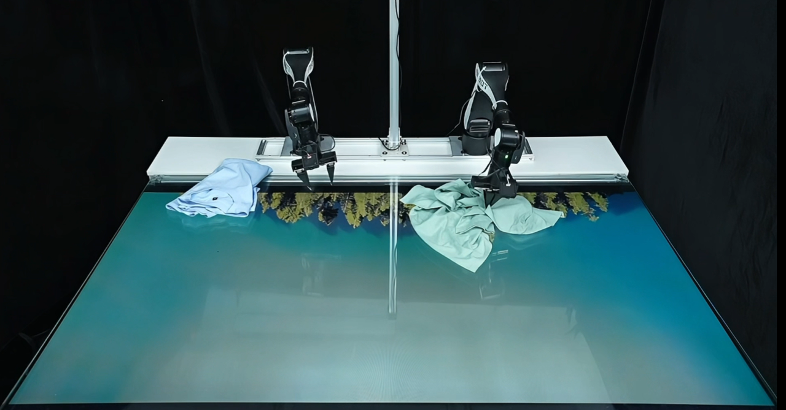

## Hardware

- Two AIRBOT Play arms with grippers
- Two 720p wrist cameras, 2.3 mm lens, 75-degree field of view
- One 1080p environment camera, 2.7 mm lens, 120-degree field of view
- Solid-color M/L short-sleeve T-shirt

Connect the cameras in this exact order: environment camera, left wrist camera, right wrist camera.

### Arm and wrist camera installation

Prepare the arm, gripper, cables, and mounting hardware shown in the reproduction guide:

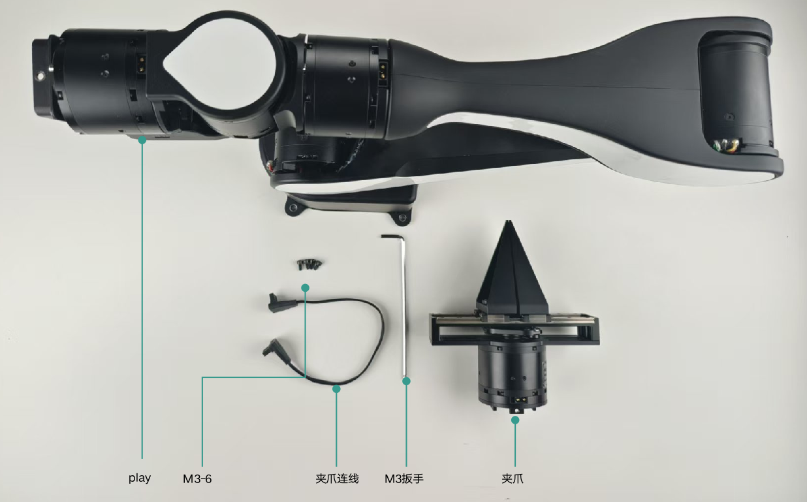

Check the flange orientation before installing the bracket and gripper:

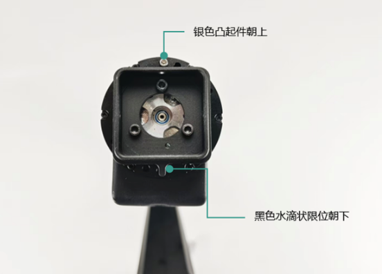

Install the wrist camera bracket and gripper as illustrated, then check the assembled camera and cable routing:

| Installation | Assembled wrist camera |
| --- | --- |
| 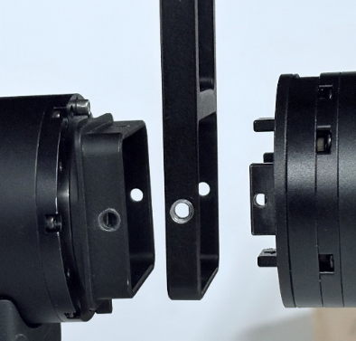 | 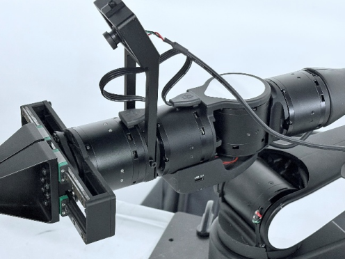 |

### Environment camera installation

Use the front and side views to check the stand placement. Follow the original installation guide for dimensions.

| Front view | Side view |
| --- | --- |
| 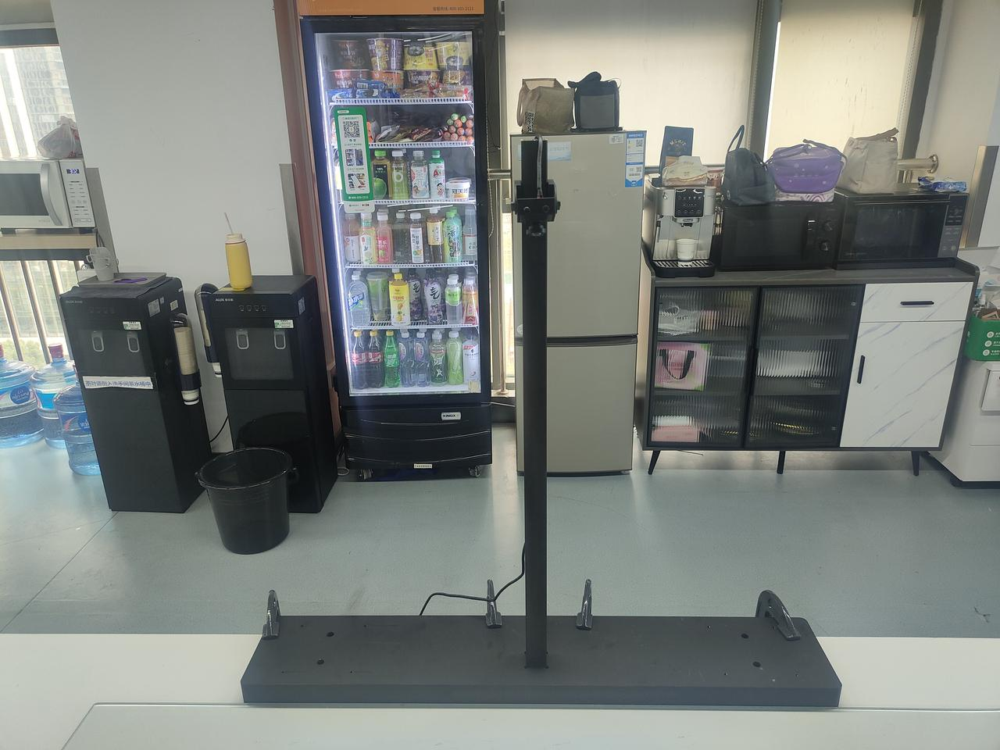 | 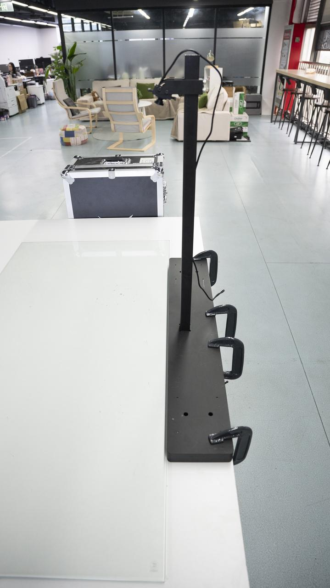 |

| Stand height reference | Camera mounting height reference |
| --- | --- |
| 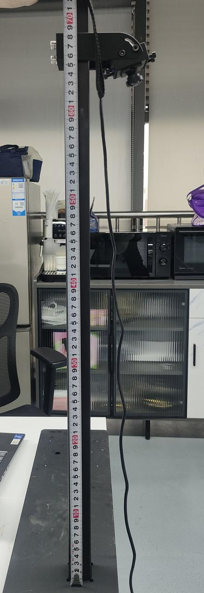 | 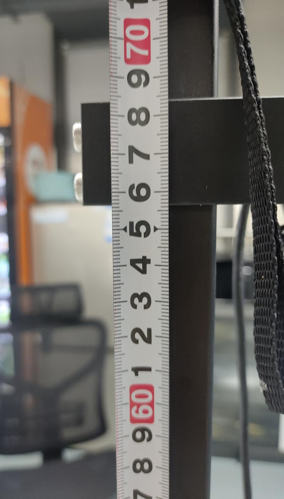 |

These installation images are extracted from the original reproduction PDF linked below.

## Software baseline

This demo is validated with AIRBOT Play **5.1.6**:

- `airbot-configure`
- `airbot_py`
- `airbot_fsm`
- Conda Python 3.10 for the robot service and `uv` Python 3.11 for policy serving
- Ubuntu 22.04 or later and an NVIDIA RTX 4090 (24 GB) or RTX 5090 (32 GB)

Do not replace these components with the V5.2 `arm_sdk` or `airbot-arm` workflow.

## Quick start

1. Download [the workstation installation guide (PPTX)](https://github.com/DISCOVER-Robotics/AIRBOT-Play-PTK-Cloth-Folding-Demo/raw/refs/heads/feat/add-demo-content/assets/cloth-folding-workstation-installation.pptx) and open it in PowerPoint, WPS Office, or LibreOffice Impress to install the workstation.
2. Clone [Openpi_RL](https://github.com/Robot-K/Openpi_RL) into `$HOME/tv_fold_demo`.
3. Install the 5.1.6 robot software and configure the three camera device IDs in `Openpi_RL/examples/airbot/robot_config.py`.
4. Download the policy and set `CHECKPOINT_DIR` in `Openpi_RL/examples/airbot/cmds/serve_policy.sh`.
5. Start the two arm services, the policy server, and then `infer_async.sh`.

```bash
mkdir -p "$HOME/tv_fold_demo"
cd "$HOME/tv_fold_demo"
git clone https://github.com/Robot-K/Openpi_RL.git

uvx --from 'huggingface_hub>=1.0' hf download \
  xiaoleezuishuai/policy-v3-wospatiodelta-iter4-tv2-280000 \
  --local-dir "$HOME/tv_fold_demo/policy_v3_wospatiodelta_iter4_tv2"
```

The original guide shows the camera configuration below. Camera indices in the screenshot are examples, not fixed assignments; detect your actual devices and keep the order environment, left wrist, right wrist.

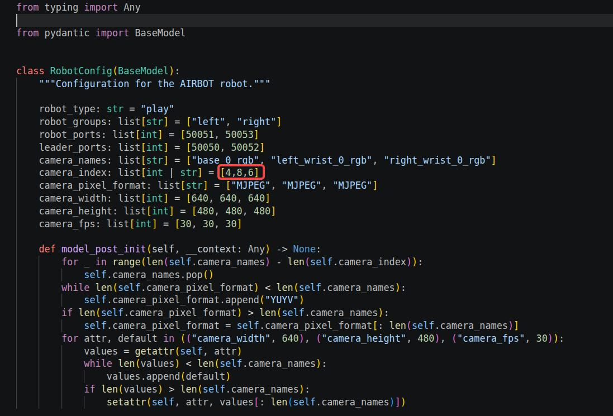

Start the arm services after verifying the CAN device assignments:

```bash
airbot_fsm -i can0 -p 50051
airbot_fsm -i can1 -p 50053
```

In the policy terminal, use `UV_PYTHON=3.11 bash serve_policy.sh`. Before inference, set `INTERPOLATE=true` and `DAGGER=false`, then run `bash infer_async.sh`. The inference controls are `Enter` to start, `D` to discard, and `Q` to exit.

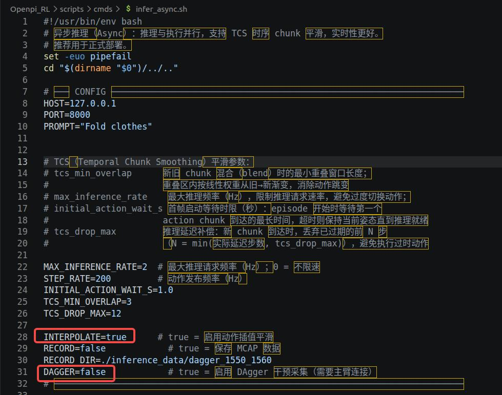

## Resources

| Resource | Location |
| --- | --- |
| Implementation | [Robot-K/Openpi_RL](https://github.com/Robot-K/Openpi_RL) |
| Pre-trained policy | [Hugging Face model](https://huggingface.co/xiaoleezuishuai/policy-v3-wospatiodelta-iter4-tv2-280000) |
| Optional training data | [Hugging Face dataset](https://huggingface.co/datasets/xiaoleezuishuai/airbot-fold-cloth-mcap) |
| Full reproduction guide | [PDF](assets/cloth-folding-reproduction-guide.pdf) |
| Workstation installation guide | [Download PPTX](https://github.com/DISCOVER-Robotics/AIRBOT-Play-PTK-Cloth-Folding-Demo/raw/refs/heads/feat/add-demo-content/assets/cloth-folding-workstation-installation.pptx) |
| AIRBOT Play 5.1.6 release | [Changelog](https://docs.discover-robotics.com/document/airbot-play/changelog.html#20250623) |
| PI0.5 reproduction | [Documentation](https://docs.discover-robotics.com/document/airbot-play/hardware-driver/tutorials/model-reproduction/pi0.5.html) |

The original CAD package is intentionally not included in this repository. Obtain its distribution approval before publishing design files.
